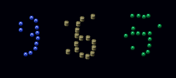

# DigitPatch MobileNet Demo

A simple PyTorch project that predicts a **three-digit number** from one image.

This project is a demonstration of how a fine-tuned **MobileNetV3 Small** model can be used to predict numbers from **deformed, blurred, or imperfect digit images**.

The repository was created mainly for learning purposes. It was used to better understand how model preparation works in practice: dataset preparation, patch extraction, labeling, fine-tuning, evaluation, and final inference.

## What this project does
Given one image with three digits, the script:
1. loads the image,
2. extracts three digit areas,
3. runs the trained model on each patch,
4. prints the final predicted three-digit number.

## Project purpose
This repository is published as an educational and motivational example.

It shows:
- how a computer vision model can be prepared,
- how a pre-trained model can be fine-tuned,
- how image patches can be used for digit classification,
- how the trained model can be evaluated,
- and how the final prediction script can be called from Python.

## Model overview
- Backbone: **MobileNetV3 Small**
- Framework: **PyTorch**
- Patch input size: **64x64**
- Output classes: **10** (`0-9`)
- Final output: **3 predicted digits joined into one number**

## Fine-tuning summary
Based on the available training scripts, the model was prepared with a transfer-learning workflow:

- MobileNetV3 Small was used as the base backbone.
- The classification head was replaced with a custom layer for **10 digit classes**.
- Training used normalized RGB digit patches resized to **64x64**.
- Light augmentation was applied during training, including rotation, translation, scale changes, and color jitter.
- Training happened in two stages:
  - **linear probe**: the classifier head was trained while feature layers were frozen,
  - **fine-tuning**: the backbone was unfrozen and the full model was trained further.

The original dataset is no longer available, so this repository focuses on the project structure, example inputs, and a simple inference script.

## Evaluation summary
Saved evaluation notes report:

- **Total evaluated samples:** 903
- **Overall patch accuracy:** **96.79%**

Important note:
The saved evaluation was run on a combined set of patches from **train**, **val**, and **test** splits. Because of that, the result should be treated as an overall evaluation summary and not as a strict unseen test-only benchmark.

### Per-class accuracy from the saved notes
- class 1: 100.0%
- class 2: 97.2%
- class 3: 87.1%
- class 4: 100.0%
- class 5: 93.8%
- class 6: 100.0%
- class 7: 99.0%
- class 8: 93.5%
- class 9: 100.0%
- class 0: not available in the saved summary

## Model availability and safety note
The trained model file is **not included** in this public repository.

It is intentionally kept private for safety reasons and to reduce the risk of misuse in gaming, automation, or other industries.

This repository is shared only as a demonstration of model training and usage. It is meant to show how a model can be fine-tuned and used for predicting numbers from deformed digit images.

## Project structure
```text
DigitPatch-MobileNet-Demo/
├── README.md
├── requirements.txt
├── predict_batch.py
├── .gitignore
├── models/
│   └── .gitkeep
├── inputs/
│   ├── 20251214_193830_965_success.png
│   ├── 20251214_202051_551_success.png
│   ├── 20251214_215025_381_success.png
│   ├── 20251215_133945_196_success.png
│   └── 20251215_152405_961_success.png
└── docs/
    └── evaluation_notes.txt
```

## Installation
```bash
pip install -r requirements.txt
```

## Run
```bash
python predict_batch.py
```

If the trained model file is not available locally, the script will not crash. It will print a short message explaining that the model is missing.

## Example input image
Example file from `inputs/`:



## Example console output
```text
Running predictions...

20251214_193830_965_success.png -> predicted: 965 | digits: [9, 6, 5] | confidence: [0.939, 0.621, 0.997]
20251214_202051_551_success.png -> predicted: 551 | digits: [5, 5, 1] | confidence: [1.0, 0.965, 1.0]
20251214_215025_381_success.png -> predicted: 381 | digits: [3, 8, 1] | confidence: [0.718, 0.791, 1.0]
20251215_133945_196_success.png -> predicted: 196 | digits: [1, 9, 6] | confidence: [1.0, 0.999, 0.998]
20251215_152405_961_success.png -> predicted: 961 | digits: [9, 6, 1] | confidence: [0.977, 1.0, 1.0]
```

## Notes
This project was kept intentionally simple. It is focused on model usage and explanation, so the old helper scripts for dataset creation, labeling, and training were not included in the main repository structure.
